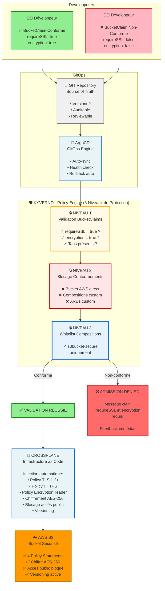

## Architecture de la Solution

### Vue d'Ensemble

Cette solution implémente une approche **Shift-Left Security** pour garantir que 100% des buckets S3 sont conformes aux politiques de sécurité ENGIE.

### Flux de Création d'un Bucket S3


### Résultats

| Avant (Réactif) | Après (Proactif) |
|-----------------|------------------|
| 60-70% conformité | ✅ 100% conformité |
| 3 mois exposition risque | ✅ 0 sec exposition risque |
| 2-5 incidents/trimestre | ✅ 0 incident |
| 40% temps équipe sécu | ✅ 10% temps équipe sécu |

### Messages Clés

- ✅ **Conformité garantie** : Validation AVANT création
- ❌ **Non-conformité impossible** : Blocage automatique
- 🛡️ **3 niveaux de protection** : Validation + Blocage + Whitelist
- 📊 **100% auditable** : Tout versionné dans Git
- 🚀 **Self-service sécurisé** : Développeurs autonomes
- ⚡ **Feedback immédiat** : < 1 seconde

# Tests de Validation

Cette section permet de valider que les policies Kyverno fonctionnent correctement et empêchent les contournements de sécurité.

## 🎯 Objectif

Démontrer que Kyverno garantit la conformité en bloquant :
- ❌ La création directe de Buckets AWS
- ❌ La création de Compositions non autorisées
- ❌ L'utilisation de Compositions non approuvées
- ✅ Tout en permettant les BucketClaims conformes

---

## Test 1 : Tentative de création directe d'un Bucket AWS

**Objectif** : Vérifier que les développeurs ne peuvent pas créer directement des Buckets AWS sans passer par les BucketClaims.

```bash
cat <<EOF | kubectl apply -f -
apiVersion: s3.aws.crossplane.io/v1beta1
kind: Bucket
metadata:
  name: test-insecure-bucket
spec:
  forProvider:
    acl: public-read
    locationConstraint: eu-west-1
  providerConfigRef:
    name: default
EOF
```

### ✅ Résultat Attendu

```
Error from server: admission webhook "validate.kyverno.svc-fail" denied the request:

policy Bucket/test-insecure-bucket for resource violation:

block-direct-bucket-creation:
  deny-direct-bucket-creation-by-users: 
    ❌ ACCÈS REFUSÉ : Création directe de Buckets S3 interdite.
    
    Les Buckets AWS doivent être créés via BucketClaims pour garantir
    l'application des politiques de sécurité ENGIE.
```

**Policy responsable** : `block-direct-bucket-creation`

---

## Test 2 : Tentative de création d'une Composition personnalisée

**Objectif** : Vérifier que seule l'équipe plateforme peut créer des Compositions.

```bash
cat <<EOF | kubectl apply -f -
apiVersion: apiextensions.crossplane.io/v1
kind: Composition
metadata:
  name: my-insecure-composition
spec:
  compositeTypeRef:
    apiVersion: s3.aws.engie.org/v1alpha1
    kind: XBucket
  mode: Pipeline
  pipeline:
    - step: bucket
      functionRef:
        name: crossplane-contrib-function-patch-and-transform
      input:
        apiVersion: pt.fn.crossplane.io/v1beta1
        kind: Resources
        resources:
          - name: bucket
            base:
              apiVersion: s3.aws.crossplane.io/v1beta1
              kind: Bucket
              spec:
                forProvider:
                  acl: public-read
                  locationConstraint: eu-west-1
                providerConfigRef:
                  name: default
EOF
```

### ✅ Résultat Attendu

```
Error from server: admission webhook denied the request:

policy Composition/my-insecure-composition for resource violation:

block-unauthorized-compositions:
  deny-user-created-compositions:
    ❌ ACCÈS REFUSÉ : Création de Compositions Crossplane interdite.
    
    Les Compositions sont gérées centralement par l'équipe plateforme
    pour garantir la conformité et la sécurité.
```

**Policy responsable** : `block-unauthorized-compositions`

---

## Test 3 : Tentative d'utilisation d'une Composition non approuvée

**Objectif** : Vérifier que seules les Compositions de la whitelist peuvent être utilisées.

```bash
cat <<EOF | kubectl apply -f -
apiVersion: s3.aws.engie.org/v1alpha1
kind: BucketClaim
metadata:
  name: test-evil-bucket
  namespace: crossplane-system
spec:
  bucketName: test-evil-bucket
  location: eu-west-1
  requireSSL: true
  encryption: true
  compositionRef:
    name: fake-composition  # ❌ Pas dans la whitelist
  tags:
    - key: Environment
      value: test
EOF
```

### ✅ Résultat Attendu

```
Error from server: admission webhook denied the request:

policy BucketClaim/test-evil-bucket for resource violation:

enforce-approved-compositions-only:
  require-approved-composition:
    ❌ COMPOSITION NON APPROUVÉE : Cette composition n'est pas autorisée.
    
    Compositions approuvées :
    - s3bucket-secure (recommandé - avec toutes les protections)
    - s3bucket-default (legacy - non recommandé)
```

**Policy responsable** : `enforce-approved-compositions-only`

---

## Test 4 : Création d'un BucketClaim conforme

**Objectif** : Vérifier que les BucketClaims conformes fonctionnent correctement.

```bash
cat <<EOF | kubectl apply -f -
apiVersion: s3.aws.engie.org/v1alpha1
kind: BucketClaim
metadata:
  name: test-valid-bucket
  namespace: crossplane-system
spec:
  bucketName: test-valid-bucket-$(date +%s)
  location: eu-west-1
  requireSSL: true
  encryption: true
  compositionRef:
    name: s3bucket-secure  # ✅ Dans la whitelist
  tags:
    - key: Environment
      value: test
    - key: Owner
      value: platform-team
EOF
```

### ✅ Résultat Attendu

```
bucketclaim.s3.aws.engie.org/test-valid-bucket created
```

**Vérification de la création** :

```bash
# Vérifier l'état du claim
kubectl get bucketclaim test-valid-bucket -n crossplane-system

# Résultat attendu :
# NAME               SYNCED   READY   CONNECTION-SECRET   AGE
# test-valid-bucket  True     True                        2m

# Vérifier le bucket créé dans AWS
aws s3api get-bucket-policy --bucket test-valid-bucket-XXXXX | jq -r '.Policy' | jq .

# Devrait afficher 4 policy statements :
# 1. enforce-tls-12-requests-only
# 2. enforce-tls-requests-only  
# 3. deny-unencrypted-object-uploads
# 4. deny-unencrypted-object-uploads-no-header
```

---

## Nettoyage

Après les tests, nettoyer les ressources :

```bash
# Supprimer le BucketClaim de test
kubectl delete bucketclaim test-valid-bucket -n crossplane-system

# Vérifier que toutes les ressources sont supprimées
kubectl get bucketclaim,xbucket,bucket -A | grep test-valid
```

---

## 📊 Résumé des Tests

| Test | Objectif | Policy | Résultat Attendu |
|------|----------|--------|------------------|
| Test 1 | Création directe Bucket | `block-direct-bucket-creation` | ❌ Bloqué |
| Test 2 | Composition custom | `block-unauthorized-compositions` | ❌ Bloqué |
| Test 3 | Composition non approuvée | `enforce-approved-compositions-only` | ❌ Bloqué |
| Test 4 | BucketClaim conforme | `enforce-s3-claim-requirements` | ✅ Créé |

---

## 🎯 Conclusion

Ces tests démontrent que :
- ✅ Kyverno bloque efficacement tous les contournements de sécurité
- ✅ Seuls les BucketClaims conformes peuvent créer des buckets
- ✅ La conformité est garantie à 100% (impossible de créer des ressources non sécurisées)
- ✅ Les développeurs reçoivent un feedback immédiat en cas de non-conformité

**Message clé** : Kyverno garantit la conformité AVANT la création, rendant impossible la création de ressources non sécurisées.

**Titre du slide :**
"Kyverno : Garantir la Conformité AVANT la Création"

**Sous-titre :**
"Validation automatique • Blocage des non-conformités • Self-service sécurisé"
